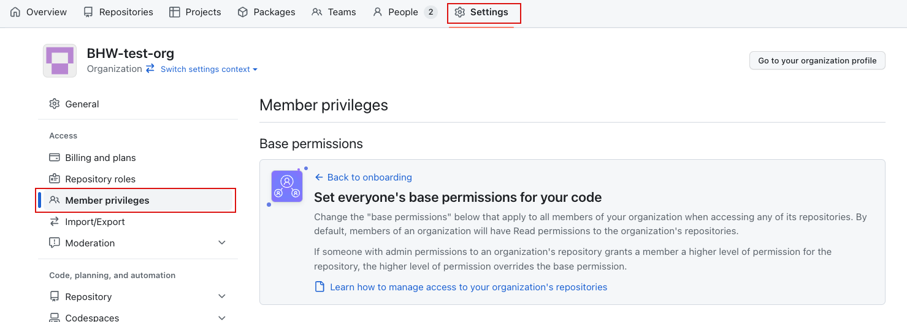
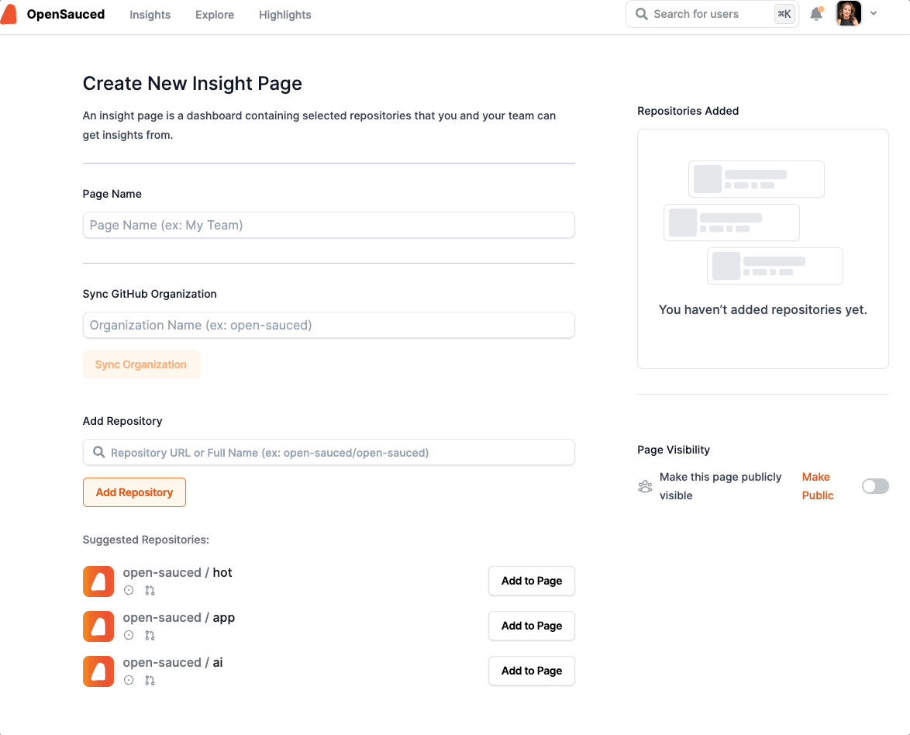

# Building Your Open Source Dream Team

Managing an open source project requires clear communication, empathy, and technical understanding. You might find that initially, you can do all or most of the work by yourself. That's great! If you want your project to grow and thrive, cultivating a diverse, motivated, and effective team around you can help you do that. This chapter looks at how to collaborate with your team effectively and offers guidance on identifying, onboarding, and empowering your open source squad.

## Types of Teams

Creating teams on GitHub allows you to grant more permissions to a group of people depending on their team status. Here are some common team types and why a maintainer might find them beneficial:

### Triage Team

Triage teams help handle incoming issues and pull requests efficiently. They categorize, prioritize, and assign issues to appropriate maintainers or contributors, reducing the maintainer's workload and ensuring timely attention to important matters.

**Benefits**: Faster response to users, improved issue tracking, and better allocation of resources.

### Maintainer Team

The maintainer team shares responsibility for code reviews, bug fixes, and feature development. A team of maintainers with specialized skills can handle larger projects, provide broader expertise, and ensure better code quality and consistency.

**Benefits**: Reduced individual workload, faster development cycles, and more diverse perspectives on code and decisions.

### Documentation (Docs) Team

The docs team creates and maintains high-quality documentation for users and contributors. A dedicated documentation team ensures clear, up-to-date information is readily available, reducing support requests and confusion.

**Benefits**: Improved user experience, easier onboarding for new contributors, and less time spent answering basic questions.

### Other Team Variations

- Security Team
- Design Team
- Community Team
- Marketing Team
- Core Team\*

?> Sometimes, the Maintainer Team and the Core Team are the same. Generally speaking, a Core Team often focuses on broader responsibilities like strategy, governance, and community management, providing insight into the project's direction. The Maintainer Team is more likely to focus on the project's day-to-day management and technical aspects.

## Assembling Your A-Team: Adding New Members

Now that you understand a little bit about teams, let's look at how to identify new members for your team.

### Recognizing the Need

Just like a superhero team expands to face escalating threats, your project might reach a point where additional team members are needed. This could be when the workload starts to overwhelm you (solo maintainer) or your existing team or when you are taking on complex challenges that require specialized expertise. Identifying these challenging points is important for ensuring your project's continued momentum.

### Scouting for Superpowers

Your search for new teammates should be deliberate and thoughtful. Look for contributors who have consistently shown commitment and skills through active involvement in your project. Their contributions to issues, pull requests, and community discussions can help you determine if they understand the project and your vision. Other things to consider are having enthusiasm, a collaborative spirit, and alignment with your project's goals. Open source projects thrive on passion and shared purpose.

### Inviting Your Team

Once you've identified potential team members, extend a formal invitation. This public acknowledgment of their contributions not only shows your appreciation but also serves as an inspiration to other community members. Platforms like GitHub offer streamlined mechanisms for adding team members, making it a seamless process to welcome your new team members officially.

## Granting Team Permissions

Each team should have a specific set of permissions that allow them to do what they need to succeed. Here are some common permissions that teams might need:

### Repository-Specific Permissions

- **Read**: Allow members to view code, issues, and pull requests.  _Suitable for stakeholders, external collaborators, or those needing general visibility._
- **Triage**: Grant permission to manage issues and pull requests (assign, label, comment, close) but not directly modify code.  _Ideal for triage teams and community managers._
- **Write**: Allow members to push code, create branches, and open pull requests.  _Necessary for developers and maintainers who are actively contributing to the codebase._
- **Maintain**: Grant broader management permissions, including deleting branches, editing protected files, and managing releases.   _Suitable for core maintainers responsible for project health._
- **Admin**: Provide full control over the repository, including sensitive actions like deleting or changing its visibility.  _Reserved for trusted individuals or those with specific administrative needs._ 

To access your team's permissions, navigate to your team's page on GitHub and click the "Settings" tab. From there, you can update your team's permissions in the "Member privileges" section.

Here's what it will look like in GitHub:

### Additional Permissions to Consider

- **Project Permissions (if using GitHub Projects)**: Grant access to manage projects, tasks, and milestones within a repository.
- **Organization-Wide Permissions**: For organization-wide teams, consider granting permissions to manage members, billing, security settings, and other organization-level features.

### Best Practices for Team Permissions

- **Start with restrictive permissions**: Grant the minimum permissions necessary for a team to perform its tasks.
- **Review permissions regularly**: As projects evolve and team needs change, revisit permissions to ensure they remain appropriate.
- **Utilize code owners**: Assign specific people or teams as code owners for different parts of the codebase to ensure appropriate oversight and review using the special [CODEOWNERS](https://docs.github.com/en/repositories/managing-your-repositorys-settings-and-features/customizing-your-repository/about-code-owners) file.

### Specific Examples

- Triage Team: Grant "Triage" permission to the triage team's primary repository.
- Maintainer Team: Grant "Write" or "Maintain" permissions to repositories they actively contribute to.
- Documentation Team: Grant "Write" permission to the documentation repository, potentially "Read" access to other relevant repositories.

You can see some of the options here:

## Expanding the Horizons: Enlisting Additional Maintainers

### Specialization: The Key to Scale

The need for specialized attention in specific areas might arise as your project grows in complexity. Documentation might require someone who can write for audiences at all levels of expertise, while community engagement might need a charismatic presence. Identifying these needs and recruiting contributors with relevant expertise allows you to delegate ownership and ensure all aspects of your project receive the dedicated care they deserve.

### Recruiting Maintainers & Team Members

It is certainly possible that there's no contributor with the right skills and passion to take on a specific role. In those cases, you might need to look outside your existing community. Reach out to other projects or communities that might have individuals with the necessary expertise.

One way to look for potential maintainers is to create a [Repository Insight Page](https://docs.opensauced.pizza/features/repo-insights/) with projects with a similar tech stack. This will allow you to see who contributes to those projects regularly, their most used languages, and more. From there, you can narrow your search to individuals who are already familiar with your project's stack and have a proven track record of contributions by adding them to a [Contributor Insight Page](https://docs.opensauced.pizza/features/contributor-insights/). Contributor Insights allows you to see more about where they're contributing, their timezone, activity level, and more.

#### Creating a Repository and a Contributor Insight Page

To connect and track your repositories, click the "+" next to "Insights" in the sidebar, then select "New Repository Insight." You will be redirected to a page where you can create your new Repository Insight Page.

There are two ways to add repositories to your Repository Insight Page:

1. **Sync GitHub organization**. Syncing your GitHub organization is a good idea if you want a unified view of your project activities and the list of contributors to your project.
2. **Add individual repositories**. Adding individual repositories is a good idea if you want to look at similar repositories to recruit team members.

From there, you can create a list of contributors you're interested in learning more about or connecting with by selecting them from the "Contributors" dashboard and creating a new Contributor Insight Page.

## Adding Team Members

Once you've identified potential team members, reach out to them. Let them know why you're asking them to become a team member and provide them with a clear understanding of what you expect if they accept the role. This will help them make an informed decision and ensure they can meet your expectations.

Check out [this guide](https://docs.github.com/en/organizations/organizing-members-into-teams/adding-organization-members-to-a-team) to learn how to add them to your team on GitHub.

## Onboarding New Team Members

To ensure that your new team members are set up for success, it's important to have an onboarding process. This will help them to understand their responsibilities, the project's goals, and how they can contribute.

Here are some things to consider:

- **Roles & Responsibilities:** Clearly define the team member's role and responsibilities. This will help them to understand what they're responsible for and what they can expect from you.
- **Communication:** Establish clear communication channels and expectations. This will help to ensure that everyone is on the same page and that you're able to communicate effectively.
- **Goals:** Clearly define the project's goals and how the team members can contribute. This will help them to understand how they can contribute to the project's success.
- **Timeline:** Set clear expectations for the timeline. This will help them understand what to do and the deadlines.

One way to onboard your new team members is to have clear guidelines and include them in your documentation. If you need an idea for creating one, you can look at the [OpenSauced Community Maintainers Guidelines](https://docs.opensauced.pizza/contributing/opensauced-maintainers-guide/community-maintainers-guide/) or read [this blog post](https://dev.to/opensauced/the-missing-piece-why-your-project-needs-a-maintainer-onboarding-process-np0).

## Keeping Track of Your Team

As your team grows, it's important to keep track of your team's participation and contributions. Depending on the number of people on your team, consider creating a [Contributor Insight Page](https://docs.opensauced.pizza/features/contributor-insights/) to keep track of your team's contributions. This will allow you to see who is contributing to your project and how often, and it will help you identify when it's time to remove someone from your team.

## Saying Farewell: Handling Team Departures

As time passes and people's lives change, you'll find that even the most dedicated teams might face departures. Inactivity, discord with project values, or mutual agreement can lead to changes in your team. It's important to approach these situations with respect and understanding. Privately communicate the reasons behind the decision, acknowledge the individual's contributions, and express gratitude for their time and effort. Remember, fostering a positive and supportive environment, even during departures, contributes to the overall well-being of your project community.

Check out [this guide](https://docs.github.com/en/organizations/organizing-members-into-teams/removing-organization-members-from-a-team) on GitHub for removing the person from your team.

## Conclusion

Remember, the team is there to support you and the project and to help you achieve your goals. As you grow your team, keep in mind that you're not just adding people to your project; you're adding people to your community. Make sure you're adding people who align with your project's values and goals and who will be a positive addition to your community.
