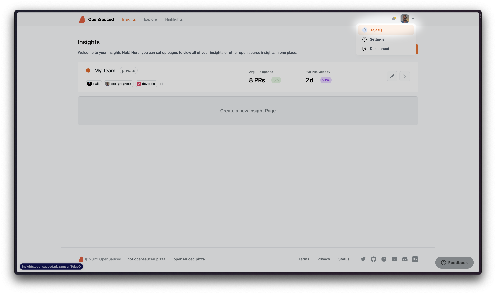
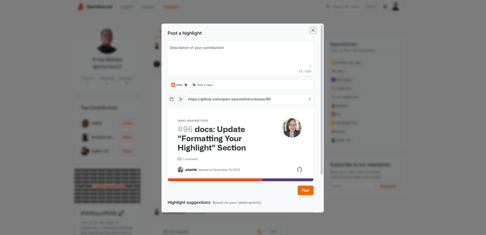

# The Secret Sauce

In this chapter, we'll share some lesser-known strategies and tips for making a lasting impact in the open source community. We'll discuss how to focus on open issues, gain traction in your contributions, and develop your open source resume using OpenSauced.

## Open Issues — More than PRs that Fix Typos

While fixing typos and improving documentation are valuable contributions to open source projects, it's essential to look beyond these low-hanging fruits and focus on addressing open issues. Tackling open issues not only helps the project move forward but also allows you to develop a deeper understanding of the codebase and demonstrate your problem-solving abilities.

Here are some tips for finding and addressing open issues:

1. **Browse the issue tracker**: Most open source projects use an issue tracker to manage bugs, feature requests, and other tasks. Browse the issue tracker to find issues that align with your interests and skills.

2. **Look for beginner-friendly issues**: Many projects use labels like "good first issue" or "help wanted" to indicate issues that are suitable for newcomers. Start with these issues to build your confidence and gain experience before tackling more complex tasks.

3. **Understand the issue**: Before diving into an issue, make sure you understand the problem and the desired outcome. If you're unsure about anything, ask questions or seek clarification from the project maintainers or other contributors.

4. **Communicate your intentions**: Before you start working on an issue, let the project maintainers and other contributors know that you're interested in addressing it. This can help avoid duplicated efforts and ensure that everyone is on the same page.

5. **Test your changes**: Once you've addressed an issue, test your changes thoroughly to ensure they work as expected and don't introduce new problems.

By focusing on open issues rather than just fixing typos, you'll make a more significant impact on the projects you contribute to and demonstrate your commitment to the open source community.

## Getting Traction in Contributions

As you become more experienced in open source contributions, you may want to increase your impact on the projects you work on and gain recognition for your efforts. Here are some strategies for gaining traction in your contributions:

1. **Become a regular contributor**: Consistently contribute to the same projects over time. This will help you develop a deeper understanding of the codebase, build relationships with other contributors, and establish yourself as a valuable member of the community.

2. **Take on challenging tasks**: As you gain experience, tackle more complex issues and features. This will not only help you grow as a developer but also demonstrate your ability to handle challenging tasks and contribute meaningfully to the project.

3. **Collaborate with others**: Open source is all about collaboration. Work with other contributors to address issues, develop features, and share knowledge. By collaborating effectively, you'll not only improve the project but also build a strong network of connections in the open source community.

4. **Share your expertise**: Share your knowledge and insights by writing blog posts, creating tutorials, or giving presentations about the projects you work on. This will not only help others learn from your experiences but also establish you as a thought leader in the open source community.

5. **Mentor new contributors**: As you become more experienced in open source contributions, consider mentoring new contributors who are just starting their open source journey. This can help you give back to the community, develop your leadership skills, and build a positive reputation.

## Building Your Open Source Resume

Building a strong open source resume can help you showcase your skills, experience, and contributions to potential employers, collaborators, and the wider developer community. OpenSauced is an excellent tool for tracking your open source contributions and developing your open source resume. Let's look at how you can use OpenSauced to support your open source journey.

1. **Sign up for an OpenSauced account**: if you haven't already created an account, visit [opensauced.pizza](https://opensauced.pizza/) and sign up for an account using your GitHub credentials.

2. **Visit Your Public Profile Page**: After signing up, a public profile page will be created for you. This page will display your GitHub profile information and a list of your open source contributions. You can navigate to it by clicking on your username in the top right corner of the page.

   

3. **Build Your Open Source Resume**: From here, you'll be able to add highlights to Pull Requests and Issues that you've contributed to. You can also add a description and links to your open source resume. These will be aggregated into a single page that you can share with others, as well as a summary of your contributions that will be displayed on your public profile page.

Let's showcase our guestbook contribution from the previous chapter! In your profile, you'll see a "Highlights" section with a text input. When you click this, you'll be able to add a title, some thoughts, and a link to your PR. This will be displayed on your public profile page. Let's add a highlight for our guestbook contribution.

### Effectively Highlight Your Contributions

Important information to include when you're highlighting your contributions:

- New material you've created,
- Project details (tools, libraries, size, and complexity),
- The type of your contributions: bug fix, feature, performance, documentation, etc.,
- The details of your contribution including improvements and impacts made on the project and on the community,
- Collaboration and teamwork details.

### Formatting Your Highlight

To be most effective in highlighting your contributions, we recommend using the following format:

- **Description**: When highlighting your contribution, we recommend mentioning the impact that it had on the overall project. This would be helpful in highlighting your qualifications for job positions, especially if you have employment gaps. Consider using the following model to help you craft this highlight into a story:
  - Success verb + noun + metric + outcome.
  - Example: While I was reviewing some pull requests for this year's GirlScript Summer of Code, I noticed that most of them would not merge in spite of me and the owner giving approvals. So, I **created a GitHub Action where pull requests automatically merge once they have passed the deployment steps(successive verb + noun)**, which **increased productivity rates by 80%(metric + outcome).**
- **Add a repo**: Provide the complete name of the repository to which you are making contributions.
- **URL**: Paste the URL to your pull request, issue or your blog post.

  

- **Share it!**: Once you've built up a portfolio of open source contributions, you can share your OpenSauced resume with others by clicking the share button in the header of your profile page. This can be especially helpful when applying for jobs, networking with other developers, or promoting your work in the open source community.

By leveraging OpenSauced to track your open source contributions and develop your resume, you'll be better equipped to showcase your skills, experience, and impact in the open source community.

In conclusion, getting started with open source contributions and making a lasting impact on the projects you work on requires a combination of technical skills, collaboration, and persistence. By focusing on open issues, gaining traction in your contributions, and leveraging tools like OpenSauced, you'll be well on your way to a successful and fulfilling open source journey.

<footer>
  <a href= "https://github.com/open-sauced/intro/blob/main/docs/intro-to-oss/06-the-secret-sauce.md">✏️ Edit this page</a>
</footer>
